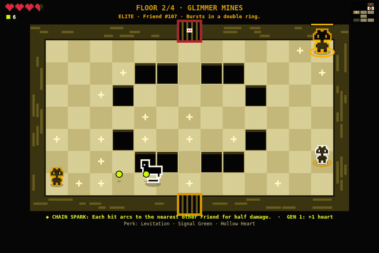
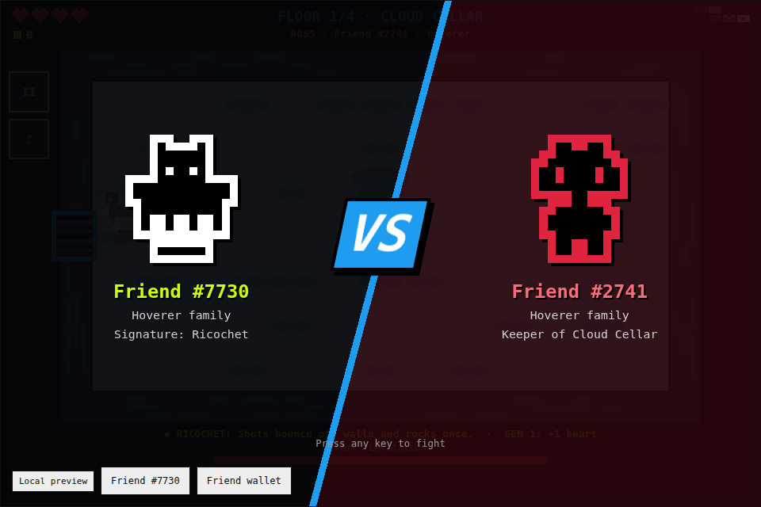

# The Binding of RareFriend





Builder: Fablizio · [GitHub @Fablizio](https://github.com/Fablizio) · [X @FabrizioCottone](https://x.com/FabrizioCottone) · [Telegram @Fablizio](https://t.me/Fablizio) · FriendSDK **v0.1.4** · Rare Friends Vibeathon (Character Spotlight)

A twin-stick, room-by-room dungeon crawler in the spirit of the classic roguelites. **Your verified
Generations Friend is the hero**, drawn from its canonical on-chain sprite, and its family gives it a
signature perk. **Every enemy and boss is another real Rare Friend** (token ID shown on screen), read
live from the SDK's pinned artwork registry on Robinhood Chain. Each floor belongs to one of the nine
Generations families, which sets the floor's look, obstacles and enemy behaviour. Floor 1 is always
your own family's turf.

No two Friends play the same: on top of the family perk, **each Friend has its own signature ability**,
derived from its canonical sprite seed and token ID, and a **generation rank** read from its
Generations generation (Gen 1 Legendary is the strongest, Gen 6 Standard gets no bonus). The run is framed as *the descent of Friend #ID*: the title card puts your Friend
front and centre, and on victory every Friend you defeated bows to yours ("The crypt remembers Friend
#ID"). The end screen has a **Copy result** line to share.

## Run it

From the SDK root (Node.js 22+):

```sh
npm ci
npm run build
npm run dev:game -- games/binding-of-rarefriend
```

Open `http://localhost:4173`, choose **Connect wallet**, switch to Robinhood mainnet if asked, pick an
owned hardwired Friend (generation ≥ 1) and press **Enter the dungeon**. Static build:
`npx friendsdk build games/binding-of-rarefriend` → `games/binding-of-rarefriend/.friendsdk/`.

**Wallet and network:** a browser wallet on **Robinhood mainnet (chain 4663)** holding a hardwired
Generations NFT. The SDK runtime handles connection, Friend selection and the fresh ownership check.
No transaction or signature is ever requested.

## Controls

| | Keyboard / mouse | Touch (hold the phone sideways) |
| --- | --- | --- |
| Move | WASD | Left thumb: drag anywhere on the left half |
| Shoot | Arrow keys (4 directions) or hold the left mouse button (aims at the cursor) | Right thumb: drag anywhere on the right half |
| Pause | P or Esc, or the **II** button | **II** button |
| Mute | M, or the **♪** button | **♪** button |

Settings (title screen) and the pause menu include **Mute**, **Music** (on by default) and **Reduce
motion** (no screen shake, room fades, bobbing, walk cycles or VS-card slide). Losing focus or hiding
the tab pauses the run and silences the music, and the game freezes whenever the runtime opens its own
menus.

## Rules

- A run is **4 floors**. Each floor is a grid of single-screen rooms: a start room, fights, one
  **treasure room** (gold door), one **shop** (green door, green dot on the minimap), one **Room of
  Pain** (spiked red door with a drop, red drop on the minimap) and a **boss room** (red door with a
  skull, farthest from the start). The treasure room, shop and Room of Pain are dead ends, so the way
  to the boss never needs a key or a toll.
- Doors lock until every Friend in the room is defeated. Clearing a room may drop a heart or a spark.

### Keys, locked rooms, chests and coins

- **Keys** (HUD counter next to sparks and coins): cleared fight rooms drop one about 12% of the
  time, some chests hold one, and the shop sells one for 4 coins. **From floor 2 on, the first fight
  room you clear on a floor always drops a key** if none has dropped there yet, so a locked room is
  always reachable.
- **Locked doors:** on floor 1 the treasure room and the shop are open. **From floor 2 on both are
  locked**: the door shows a padlock (and the minimap a small lock). Walk into it with a key to open it
  for good (one key, with a click); without a key the game says "needs a key". The boss room and the
  Room of Pain never need a key.
- **Chests** are rare, about one or two a floor: 4% of regular kills drop one (at most three a floor),
  the floor's elite drops one 35% of the time, and a reward Room of Pain always has one. About 40% are
  **locked chests** (grey with a gold padlock, need a key); the rest are **open chests** (brown, open on
  touch). An open chest spills 1–4 coins and sometimes a half heart (25%) or a key (15%). A locked
  chest spills 3–7 coins, plus a relic (30%) or a heart (35%).
- **Coins** (HUD counter) come from chests, and cleared fight rooms drop one about 25% of the time.
  They are spent in the shop.
- **Shop:** one per floor, with 3–4 items on pedestals and price tags: half heart **2**, heart **3**,
  key **4**, heart container (+1 max heart) **8**, a relic **7–10** (from the relic pool, never one you
  hold or one already on offer). Walk over an item to buy it; without enough coins it says "need N
  coins", and hearts are not sold while your health is full. Bought items disappear. Walking is buying,
  so keyboard and touch work the same.
- **Room of Pain:** at most one per floor, off a dead end, behind a spiked red door with a blood drop.
  **Crossing its door costs half a heart each way** (in and out, one heart for the round trip), shown
  as a floating "-½ ♥" with the hurt sound. It is a toll, not a hit: no invulnerability, no knockback,
  and **it can never kill you: at half a heart the toll leaves you at half a heart**. The floor's
  seeded RNG decides what waits inside: either a **tougher fight** (an arena, two more Friends, many
  of them elites; the doors lock until it is cleared, then a relic rises) or a **reward room** (a
  relic on a pedestal plus an open or locked chest).
- Coins, keys and chests are **run-only** and reset with every run. They are not RF and never touch
  the wallet; the end screen lists the coins and keys you collected.
- Each floor has one **elite room** (gold diamond on the minimap), the normal room farthest from the
  start, in an arena layout. Its **elite** is a real Friend of the floor's family at 4× size with a gold
  halo, a health bar, more health and one extra family move (table below). It always drops a reward: a
  heart if you are hurt, otherwise a bundle of three sparks.
- Entering a boss room shows a **VS card**: your Friend (family, signature) against the keeper (a real
  Friend at 6× size). The room is frozen while it shows (about 2.4 s); any key or a tap skips it. With
  reduced motion it is a static card.
- Beat the floor's boss (the keeper) to get a relic, a heart and the hatch down. The last boss opens
  the way out.
- You start with 3 hearts. Contact and enemy shots cost half a heart (bosses a full heart from
  floor 2). Brief invulnerability follows each hit. Zero hearts ends the run.
- Relics (treasure rooms, bosses, the shop, locked chests and Rooms of Pain) stack: Bone Marrow (+1 heart), Spare Mask (+damage), Family
  Photo (familiar), Petri Dish (split shots), Crooked Lens (fire rate), Hover Boots (flight), Colossal
  Knuckle (big shots), Sparkle Dust (shot speed and range), Hollow Heart (speed, invulnerability),
  Signal Green (homing).
- Sparks are score only. The end screen lists every real Friend you faced, by token ID.

### Your family perk

| Family | Perk |
| --- | --- |
| Skeleton | Piercing shots |
| Mask | Twin parallel shots |
| Family | Starts with a mini-me familiar |
| Cellular | Shots split on hit |
| Asymmetry | Wobbly shots, +25% damage |
| Hoverer | Flight over pits and rocks |
| Colossus | +1 heart, huge shots, slower |
| Sparkling | Every 6th shot bursts in 8 directions |
| Hollow | Longer invulnerability, faster |

### Your Friend's signature

Every Friend also gets one of eight signature abilities. It is picked by a deterministic hash of the
Friend's canonical sprite seed and token ID (`engine/signatures.ts`), so the same Friend always has the
same signature on every device, and the eight are spread evenly across token IDs (about 12.5% each). The
signature is shown on the title card and in the HUD's bottom line, and it stacks with the family perk
and with relics (for example Ricochet with piercing Skeleton shots, or Chain Spark with Mask's twin shots).

| Signature | Effect |
| --- | --- |
| Ricochet | Shots bounce off walls and rocks once. |
| Boomerang | Shots fly out, turn around (or turn at a wall) and hit again on the way back. |
| Orbit Shard | A shard circles you, cutting Friends it touches and blocking enemy shots. |
| Chain Spark | Each hit arcs to the nearest other Friend (within range) for half damage. |
| Critical Eye | 12% of hits deal triple damage, with a CRIT flash. |
| Heart Leech | 4% of kills drop a half heart; each boss drops an extra heart. |
| Trailblazer | Moving leaves a short trail of pixels that burns Friends standing on it. |
| Fifth Shot | Every fifth shot is bigger, deals 60% more damage and pierces. |

### Generation rank

The game reads your own Friend's `generation(tokenId)` once from the Generations contract
(`0x14C4…181D` on Robinhood Chain), the same value the runtime's eligibility check uses. It is a single
read of your verified Friend, never a scan. The generation sets a rank on a ladder: the rarer the
generation, the stronger the bonus. It stacks on top of the family perk and the signature, and is shown
on the title card, the boss VS card and the HUD (e.g. `GEN 1 · LEGENDARY: +1 heart, +15% dmg, +10% fire rate`).
If the read fails or times out, no bonus or label is shown and the run plays normally. The rank is a
gameplay bonus only; it does not change who can play (any hardwired Friend, generation ≥ 1).

| Generation | Tier | Bonus |
| --- | --- | --- |
| 1 (rarest) | Legendary | +1 heart, +15% damage, +10% fire rate, gold outline around your Friend |
| 2 | Epic | +1 heart, +10% damage |
| 3 | Rare | +10% damage, +5% fire rate |
| 4 | Uncommon | +10% damage |
| 5 | Common | +5% damage |
| 6 and later | Standard | none (label only) |

The gold outline is drawn around the canonical sprite and its white halo; the sprite pixels are unchanged.
Genesis NFTs are a separate collection that FriendSDK v0.1.4 cannot select as a player; a Genesis-holder perk is on the roadmap.

### Sharing a run

The victory and death screens show a one-line result, for example *"Friend #25090 (Hoverer, signature:
Ricochet) cleared 4 floors and defeated 23 real Rare Friends in 12:31 — The Binding of RareFriend
https://fablizio.github.io/the-binding-of-rarefriend/"*. **Copy result** tries the clipboard (the sandbox
may refuse it); the text is always shown in a selectable box so it can be copied by hand. "Copied ✓"
appears only when copying succeeded.

### Floors and enemies

| Family | Floor | Enemy behaviour |
| --- | --- | --- |
| Skeleton | The Ossuary | Rattlers chase you around obstacles |
| Mask | Masquerade Hall | Mimics keep distance, shoot and blink away |
| Family | The Old House | Kin come in threes and lunge |
| Cellular | Culture Vats | Cells split into two smaller cells |
| Asymmetry | The Crooked Wing | Glitches zigzag and fire diagonal shots |
| Hoverer | Cloud Cellar | Drifters fly over pits and rocks |
| Colossus | Colossus Quarry | Brutes charge when you line up |
| Sparkling | Glimmer Mines | Glints burst rings of shots |
| Hollow | The Hollow | Shades vanish and reappear next to you |

Bosses mix three family attacks (rings, aimed spreads, charges, summons, spirals, blinks, slams) and
speed up below half health.

### Elites

| Family | Elite's extra move |
| --- | --- |
| Skeleton | Raises two Rattlers once, when wounded |
| Mask | Fires a fan of five shots after every blink |
| Family | Calls two Kin every few seconds (at most four helpers) |
| Cellular | Splits into three cells instead of two |
| Asymmetry | Every shot is mirrored into a full X |
| Hoverer | Rises, then dives at where you stood |
| Colossus | A charge that hits a wall ends in a shockwave ring |
| Sparkling | Bursts in a double ring |
| Hollow | Leaves a harmless decoy when it fades out |

### Rooms

31 hand-made layouts: the 13 original ones (one is the empty room), 9 new ones (asymmetric rocks and pits, lanes, stepping
stones, and three open arenas used for elite rooms) and one themed layout per family (Skeleton
ribcage, Mask face, Family dinner table, Cellular cells, Asymmetry crooked line, Hoverer open sky,
Colossus boulders, Sparkling crystal field, Hollow void rifts). Themed layouts appear twice as often
on their own family's floor. Every layout is randomly mirrored, door approaches are forced clear, and
each generated room is checked for connectivity (the sim also checks every layout).

### Music

Every floor has its own looping chiptune, synthesized in code with WebAudio (square/triangle lead and
bass, noise drums; no samples or files). The Ossuary is a slow harmonic-minor walk, Masquerade Hall a
3/4 waltz, The Old House warm major, Culture Vats bubbly pentatonic staccato, The Crooked Wing dorian in
7/8, Cloud Cellar airy lydian, Colossus Quarry heavy slow phrygian, Glimmer Mines sparkly major
arpeggios and The Hollow sparse whole-tone. Boss rooms play a faster variant a semitone higher with
driving bass and busier drums. Victory plays a short jingle and death a falling sting. Notes are
scheduled ahead on the AudioContext clock (a 60 ms timer, 160 ms lookahead). Floors crossfade, and the
music sits under the sound effects. It starts only after **Enter the dungeon** and stops while
paused, in a menu or when the tab is hidden (the audio context is suspended then). It follows **Mute**
and has its own **Music** toggle.

## How the Friends are chosen

At the start of each run (and on **New cast**), the game samples 120 random token IDs from
1–100,000 (hardwired Friends also exist above that range; enemies are simply sampled from it), and reads each ID's family from the
SDK's pinned sprite registry (`familyOf`). It then groups them into floors and reads `seedOf` and the
64 canonical frames (`frames`) of up to six Friends per floor. Reads go through one Multicall3 call per step, with a fallback
to individual JSON-RPC batched reads. Only the public **artwork registry** is read for other Friends (plus one `generation` read of your
own Friend for its bonus). The Generations collection is never scanned, no owners are looked up, and nothing depends on who holds those Friends.
Enemy art is the unmodified canonical 16×16 mask at integer scale with a family-coloured halo. The
player keeps the canonical black mask and white halo (plus a gold outline around it for Generation 1).

## Economy

**Play is free: 0 RF.** There are no purchases, consumables or rewards, and nothing is simulated as
RF. Sparks, coins, keys, chests, shop items and relics are run-only game items and reset with every
run; shop prices are in those run-only coins, never RF. The SDK v0.1.4 runtime still requires a
chance-game `game.json`, so this directory includes **unused schema-only terms** (a 1 RF token with a
single 100% / 10,000 bps reward of 1 RF, both `1000000000000000000` base units). The component never
calls `buy`, `play`, `settle` or `redeem`.

Future RF ideas, not implemented: RF-backed shop coins (the shop is built so its coin prices could
later be backed by RF through a proper integration), an RF-priced "second chance" heart, RF-backed cosmetic halos
for your Friend, and a weekly seeded "daily crypt" with an RF-funded prize pool. Each would need
custom integration beyond the v0.1.4 bridge, which has no persistence, upgrade or extra-currency APIs.

## Checks

Run from the SDK root. All of these were run for the current version and pass.

- `npx friendsdk check games/binding-of-rarefriend`: game validation.
- `npx tsc -p games/binding-of-rarefriend/tsconfig.json`: strict typecheck.
- `node games/binding-of-rarefriend/tests/run-sim.mjs`: checks that all 31 layouts are 13×7 and
  fully connected, and that 300 generated floors each have an elite room (with no fallback to an
  empty room). On 400 more floors it checks one shop and one Room of Pain per floor, every room
  connected with two-way doors, the boss reachable without keys or tolls, the treasure room, shop,
  Room of Pain and boss room as dead ends, locks only from floor 2, and the same layout for the same
  seed. It checks the pain toll directly (6→5→4, and 1 stays 1, never a hit), fails any bot run where
  a toll kills or where a floor-2+ first cleared fight room gave no key, and reports loot per floor. It checks that signatures are deterministic and evenly spread over 20,000 token IDs.
  Then a headless bot plays 54 full runs (all nine player families, invulnerable and normal, cycling
  through all eight signatures and generation ranks) and 72 more balance runs (every signature with
  the same nine seeds), then 18 runs as generation 1 and the same 18 as generation 6. It also checks
  that each generation's bonus is stronger than the next one's. It fails on any room the bot cannot clear, elite and boss rooms included.
  Latest result, after difficulty was raised following playtesting (enemies +25% HP and +10% speed,
  enemy shots +10% faster with 10% shorter cooldowns, elites and bosses +30% HP, bosses enrage at 60%
  HP instead of 50%, one more Friend per fight room from floor 2, fewer hearts after cleared rooms):
  the invulnerable bot still clears 27/27 runs, so every layout stays beatable. The simple normal bot,
  which never dodges, now reaches floor 1.63 on average (2.37 before), 1.2–1.7 per signature, and dies
  mostly to the first boss (20 of 27 runs). On the same 18 seeds it reaches floor 2.33 on average as
  generation 1 (Legendary) and 1.39 as generation 6.
  After keys, chests, coins, shops and Rooms of Pain (the bot picks up coins, keys and chests, uses
  keys, buys relics, containers, keys and hearts it can afford, and pays the pain toll with at least
  two hearts): the invulnerable bot still clears 27/27; the normal bot reaches floor 1.78 on average
  (1.63 before; +0.15, from shop hearts and the extra relics), dying mostly to bosses (16 of 27). The invulnerable bot finds about 5.5 coins, 1.5 keys and 1.3 chests a floor and opens 53 locks (doors and chests) over 27 runs.
- `node games/binding-of-rarefriend/tests/browser.mjs`: real SDK runtime in headless Chromium with the
  SDK's mock wallet and RPC fixtures, extended to answer the artwork registry and Multicall3 for many
  IDs (the fixture reports generation 1). Checks desktop, phone landscape and phone portrait for browser
  errors, including the music scheduler. It covers the title card, an elite room (arena layout, one
  elite), the boss **VS card** (the room must stay frozen behind it and a key or tap must skip it), a
  floor-1 shop (open, 3–4 items), floor-2 locks (treasure and shop locked, the door stays shut without a
  key) with an open and a locked chest, a Room of Pain door and its entry toll, the
  victory and death screens and the **Copy result** text and button. It takes screenshots
  (`media/vs.png` comes from it).
- `node games/binding-of-rarefriend/tests/run-visual.mjs`: renders mid-combat and boss frames for
  several themes.
- `node games/binding-of-rarefriend/tests/run-demo.mjs`: renders `media/demo.gif` frame by frame
  (a floor-2 elite room, then the boss; bot at the controls, SDK sample sprites as stand-ins for real
  Friends) and converts it with ffmpeg. The GIF is canvas-only, so it has no VS card or music.
  `media/title.png` is the desktop title screenshot from the browser check (fixture Friend #7730).

The stock `npx friendsdk test` fixture only answers artwork reads for sample Friend #7730, so it
rejects this game's roster reads by design. The custom browser check above covers that path.
Mock identities and sample sprites are used only in these tests. The real ownership gate needs a
real-wallet playtest.

## Credits

Code, level design, rooms, props and sound effects by Fablizio (AI-assisted). All scenery is drawn
from code, and all sounds and music are synthesized from code. Character artwork: canonical Rare Friends
Generations sprites via the FriendSDK sprite reader (see the SDK `NOTICE.md`). Reward cues come
from the FriendSDK sound kit. Inspired by the room-based twin-stick roguelite genre. Not affiliated
with any other game.
